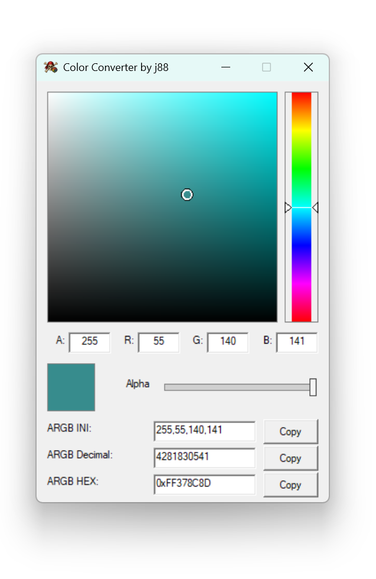

# Storm Engine Color Converter

Небольшая утилита для работы с цветовыми значениями в играх на движке **Storm Engine**.

Программа создана для моддинга игр серии:
- Корсары: Город Потерянных Кораблей
- Корсары 3
- Age of Pirates
- и других проектов на базе Storm Engine.

---

## Возможности

- выбор цвета через палитру;
- поддержка Alpha-канала (прозрачности);
- автоматическая конвертация цветовых значений;
- быстрый вывод форматов:
  - ARGB
  - Decimal
  - HEX
- кнопки быстрого копирования;
- portable-версия без установки.

---

## Поддерживаемые форматы

| Формат | Пример |
|---|---|
| ARGB | `255,55,140,141` |
| Decimal | `4281830541` |
| HEX | `0xFF378C8D` |

---

## Для чего нужна утилита

В играх на движке Storm Engine цветовые значения часто используются в:
- интерфейсах;
- HUD;
- игровых скриптах;
- UI-элементах;
- настройках шрифтов и текста.

Утилита позволяет быстро подобрать нужный цвет и получить готовое значение в нужном формате без ручных пересчётов.
